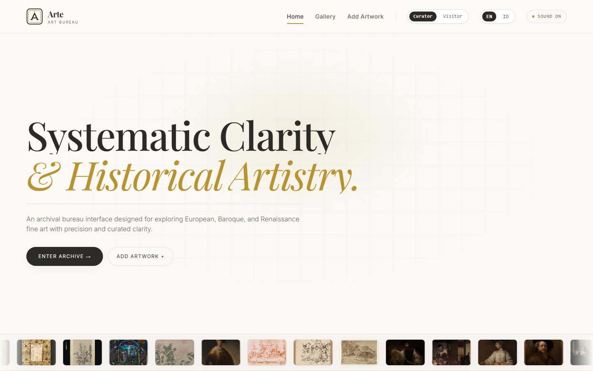
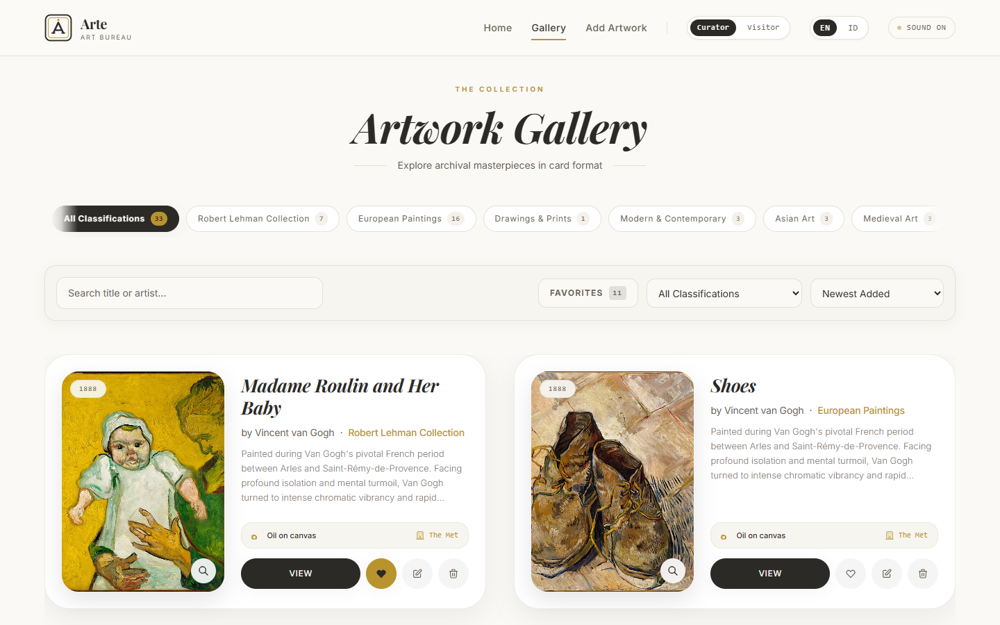
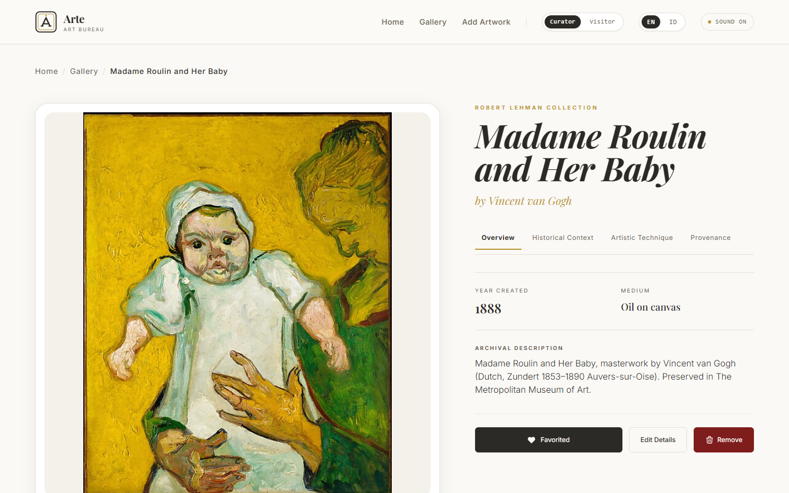
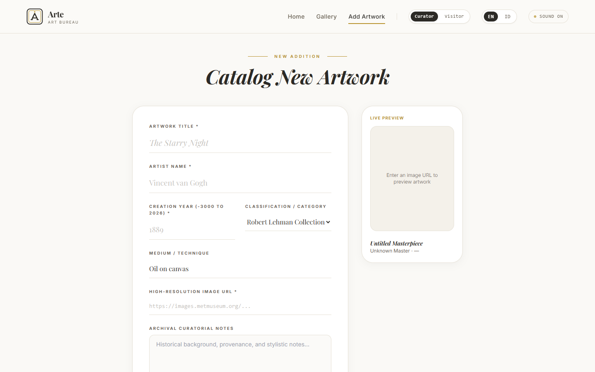
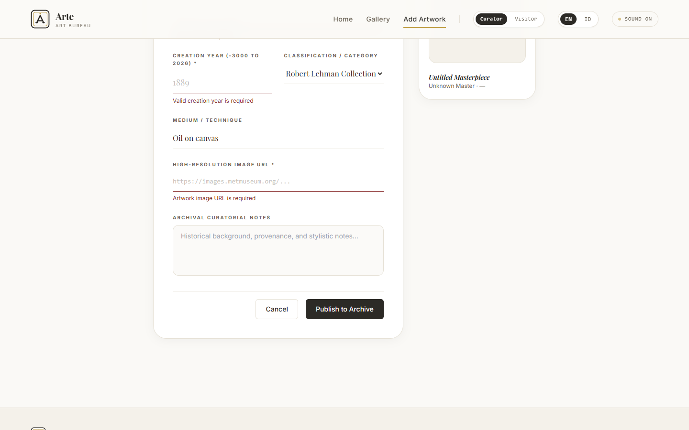
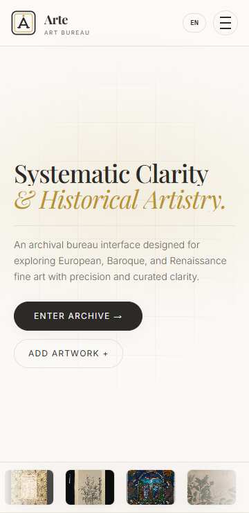

# Arte — Classical Art Bureau & Archive

Aplikasi web arsip dan katalog seni rupa klasik interaktif berbasis React 19, Vite, dan Tailwind CSS. Proyek ini dibangun sebagai implementasi Proyek Akhir Pelatihan React Fundamental 2026.

> 🔗 **Live Demo (Vercel):** _`<TAMBAHKAN-LINK-DEPLOYMENT-VERCEL>`_
>
> 📦 **Repository GitHub:** [https://github.com/a1fariz/arte](https://github.com/a1fariz/arte)

---

## 🖼 Tampilan Aplikasi

| Dashboard (Desktop) | Katalog Galeri |
| --- | --- |
|  |  |

| Detail Karya | Form Tambah Karya |
| --- | --- |
|  |  |

| Validasi Form | Mobile (360px) |
| --- | --- |
|  |  |

---

## 📌 Daftar Fitur Aplikasi

1. **Dashboard & Showcase Visual (Home)**:
   - Headline editorial dinamis dengan animasi punch-word.
   - Infinite film-strip marquee 33 karya seni dengan tautan langsung ke detail (otomatis pause saat tidak terlihat di layar).
   - Semicircle 360° Circular Orbit Gallery (desktop) & Single Touch Preview (mobile) — animasi berhenti saat di luar viewport untuk efisiensi.
   - Prominent Masters Showcase (Vincent van Gogh, Rembrandt, Vermeer, Edgar Degas) dengan pergantian profil instan.
   - Selected Curated Exhibition (4 highlight lukisan).

2. **Katalog & Arsip Galeri (Gallery)**:
   - **Pencarian Real-time**: Mencari lukisan berdasarkan judul atau nama pelukis menggunakan method `.filter()`.
   - **Filter Klasifikasi**: Memfilter karya berdasarkan kategori museum (European Paintings, Drawings & Prints, Robert Lehman Collection, Modern & Contemporary, Asian Art, Medieval Art).
   - **Pilihan Favorit**: Filter instan untuk hanya menampilkan karya yang disukai pengguna.
   - **Sorting Multi-Kriteria**: 6 pilihan pengurutan menggunakan method `.sort()` (Terbaru, Terlama, Judul A–Z, Judul Z–A, Tahun Baru–Lama, Tahun Lama–Baru) — berjalan beriringan dengan pencarian & filter.
   - **Pagination Dinamis**: Pembagian data per halaman dihitung dengan `Math.ceil()`, tombol Previous/Next nonaktif di awal/akhir, dan indikator halaman aktif.
   - **Pesan Hasil Kosong**: Tampilan responsif saat pencarian tidak ditemukan, lengkap dengan tombol reset filter.
   - **Lightbox**: Pratinjau gambar ukuran penuh dengan navigasi keyboard (Esc untuk menutup, focus trap), swipe-to-dismiss di mobile.

3. **Pengelolaan Data (CRUD Lengkap)**:
   - **Create (Tambah Data)**: Menambahkan karya baru melalui form `/gallery/add`.
   - **Read (Lihat Detail)**: Halaman detail `/gallery/:id` dengan kuratorial essay, catatan sejarah, analisis teknik, dan provenance (4 tab).
   - **Update (Ubah Data)**: Form edit `/gallery/:id/edit` terisi otomatis data sebelumnya (*pre-populated*) dan tersimpan tanpa refresh halaman.
   - **Delete (Hapus Data)**: Hapus karya dengan modal dialog konfirmasi (`ConfirmDialog`) yang konsisten di seluruh halaman.
   - **Validasi Form**: Validasi judul, nama artis, tahun (-3000 hingga 2026), URL gambar, dan panjang deskripsi — dengan atribut `aria-invalid` untuk screen reader.
   - **Penyimpanan Lokal**: Sinkronisasi otomatis ke `localStorage` browser + tombol pemulihan dataset asli.

4. **Multi-Role & Bilingual**:
   - **Role Switcher**: Mode Kurator (bisa menambah, mengedit, dan menghapus karya) vs Mode Pengunjung (read-only & favorit).
   - **Dua Bahasa (Bilingual)**: Bahasa Indonesia dan English — seluruh UI terjemahan penuh, tersimpan sebagai preferensi.
   - **Sound FX**: Efek audio sintetis Web Audio API (klik, transisi, chime) dengan toggle on/off — hanya aktif setelah interaksi pengguna sesuai kebijakan autoplay browser.

5. **Aksesibilitas & Performa**:
   - Navigasi keyboard penuh: focus trap pada modal (Lightbox & ConfirmDialog), `aria-label` pada seluruh tombol ikon, `aria-pressed` pada toggle, `aria-current` pada pagination.
   - Menghormati `prefers-reduced-motion` — preloader, curtain, dan marquee dimatikan bila user mengaktifkan reduce motion di OS.
   - Optimasi performa: animasi hanya berjalan saat elemen terlihat (IntersectionObserver), transisi tanpa animasi `filter` yang berat di GPU, dan thumbnail menggunakan varian gambar Met yang 2.5× lebih ringan.
   - Desain adaptif penuh di Mobile (360px+), Tablet (768px–1024px), dan Desktop (>1200px) — tanpa horizontal overflow.

---

## 🛠 Teknologi yang Digunakan

- **Package Manager**: pnpm
- **Library Utama**: React 19
- **Build Tool**: Vite v8
- **Styling**: Tailwind CSS v3 (utility-first, custom design tokens)
- **Routing**: React Router DOM v7 (`BrowserRouter`, `Routes`, `Route`, `Link`, `useParams`, `useNavigate`)
- **State Management**: React Context API (`createContext`, `useContext`) + `useState` + `useMemo`
- **Animasi & Transisi**: Framer Motion
- **Linting**: oxlint
- **Bahasa Pemrograman**: JavaScript Modern (ES6+):
  - `let` dan `const`
  - Arrow Functions
  - Template Literals
  - Destructuring Assignment
  - Spread Operator (`[...artworks]`, `{...prev}`)
  - Rest Parameter (`cn = (...classes)` di `src/utils/helpers.js`)

---

## 📁 Struktur Folder Proyek

```
arte/
├── public/                 # Aset statis
│   ├── favicon.svg         # Favicon logo Arte
│   └── logo.svg            # Logo (dipakai Navbar, Footer, preloader)
├── screenshots/            # Screenshot aplikasi (untuk README)
├── src/
│   ├── components/         # Komponen UI modular
│   │   ├── layout/         # Layout, Navbar, Footer
│   │   ├── ui/             # Button, Pagination, MagneticButton
│   │   ├── ArtworkCard.jsx      # Kartu karya (list item)
│   │   ├── CircularGallery.jsx  # Orbit gallery 360°
│   │   ├── ConfirmDialog.jsx    # Modal konfirmasi (accessible)
│   │   ├── Lightbox.jsx         # Pratinjau gambar full-screen
│   │   └── MasterArtistShowcase.jsx
│   ├── context/            # State global Context API
│   │   ├── GalleryContext.jsx   # CRUD data karya & role
│   │   └── LanguageContext.jsx  # Bahasa EN / ID
│   ├── data/               # Dataset lokal
│   │   ├── met_artworks.json    # 33 karya seni The Met Museum (Open Access)
│   │   └── dummyData.js
│   ├── pages/              # Halaman routing
│   │   ├── Dashboard.jsx        # Halaman utama / beranda
│   │   ├── GalleryPage.jsx      # Halaman katalog & filter
│   │   ├── ArtworkDetail.jsx    # Halaman detail karya
│   │   ├── ArtworkForm.jsx      # Halaman tambah & edit karya
│   │   └── NotFound.jsx         # Halaman 404
│   ├── utils/              # Helper & utilitas
│   │   ├── audio.js             # Web Audio API sound FX
│   │   ├── helpers.js           # Helper ES6 (cn, smallImageUrl)
│   │   ├── storage.js           # localStorage adapter
│   │   └── translations.js      # Kamus terjemahan EN / ID
│   ├── App.jsx             # Root routing React Router
│   ├── index.css           # Konfigurasi dasar Tailwind
│   └── main.jsx            # Entry point React
├── vercel.json             # Konfigurasi rewrite SPA Vercel
├── vite.config.js
├── tailwind.config.js
└── package.json
```

---

## 🚀 Cara Instalasi dan Menjalankan

### Prasyarat
- Node.js versi 18 atau lebih baru
- pnpm (rekomendasi) — instalasi: `npm install -g pnpm`

### Langkah Instalasi
1. Clone repositori:
   ```bash
   git clone https://github.com/a1fariz/arte.git
   cd arte
   ```

2. Pasang dependencies:
   ```bash
   pnpm install
   ```

3. Jalankan server pengembangan (local dev):
   ```bash
   pnpm run dev
   ```
   Aplikasi akan aktif di `http://localhost:5173/`.

4. Build untuk mode produksi:
   ```bash
   pnpm run build
   ```
   Hasil build tersimpan di folder `dist/`.

5. Menjalankan preview build produksi:
   ```bash
   pnpm run preview
   ```

---

## ☁ Deployment

Aplikasi di-deploy ke **Vercel**. File `vercel.json` berisi rewrite SPA sehingga refresh langsung pada URL detail (misal `/gallery/:id`) tetap berfungsi tanpa error 404.

---

## 📄 Lisensi & Atribusi

Hak cipta data karya dan gambar bersumber dari Program [Open Access The Metropolitan Museum of Art](https://www.metmuseum.org/about-the-met/policies-and-documents/open-access) (The Met), New York.
